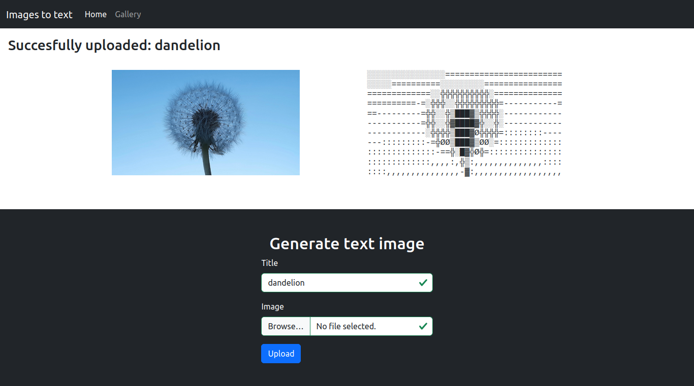

# Text Images Online
Do you want to recreate your images in text symbols? If yes, this is what this app does. It is a simple web application implemented in `Python` using `Django`.

## Installation
1. Clone the repository
2. Create virtual python environment
3. Install all the packages stated in requirements.txt
4. Open project directory
5. Run `python manage.py makemigrations` and  `python manage.py migrate`
6. To test the application locally run `python manage.py runserver`